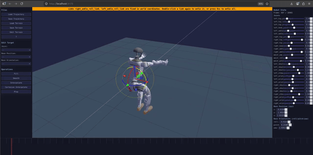

# Robot Trajectory Editor

Web-based editor for inspecting, repairing, and authoring robot joint and floating-base trajectories directly against a URDF model in 3D.

Teaser: 

## Key Features

- **Trajectory I/O and playback**: load and save `.npz` motions, scrub or play them on a URDF robot, and inspect or numerically edit every joint and base channel.
- **Visual timeline editing**: draw channel values by dragging keyframes, select time segments, and apply fill, smoothing, joint-space interpolation, nudging, and multi-level undo.
- **Trajectory base transform**: shift and rotate the entire base position/orientation sequence with live sliders (`x`/`y`/`z`/`roll`/`pitch`/`yaw`) — updates the 3D view and timeline in real time, confirmed with Apply and revertable with a single `Ctrl+Z`.
- **Direct 3D manipulation**: drag robot links with IK, translate or rotate the base, and pin multiple links to world-space poses while editing the motion.
- **Cartesian trajectory interpolation**: interpolate selected link targets linearly or cubically with per-link position-only or full-pose constraints; floating-base IK solves each frame transactionally.
- **Terrain workflow**: load `.obj` or `.stl` terrain, crop, down-sample, move, rotate, and export the edited mesh as `.obj`.
- **Keyboard-first navigation**: step frames, mark timeline segments, cycle Edit Targets within their channel groups, nudge values, play, save, and undo without leaving the viewport.

## Quick Start

```bash
# Launch both backend + frontend (prompts to install missing Python/npm dependencies)
./launch.sh [--robot-urdf /path/to/robot.urdf] [--port 5000] [--nudge-step 0.01] [--frame-step 1]
```

Then open http://localhost:5173.

### Manual launch

#### 1. Start Backend

```bash
cd robot_trajectory_editor/backend
pip install -r requirements.txt
python app.py --robot-urdf /path/to/robot.urdf --port 5000
```

#### 2. Start Frontend

```bash
cd robot_trajectory_editor/frontend
npm install
npm run dev
```

Open http://localhost:5173 in a browser.

## Testing

```bash
# Backend tests
cd robot_trajectory_editor/backend && pytest tests/ -v

# Frontend tests
cd robot_trajectory_editor/frontend && npm test
```

## Architecture

- **Backend**: Flask + numpy for `.npz` trajectory I/O and URDF asset serving
- **Frontend**: React + TypeScript + Vite, Three.js for 3D visualization, zustand for state
- **IK**: `closed-chain-ik`, wrapped by `frontend/src/three/IkSolver.ts`; direct manipulation keeps the trajectory-driven base locked, while Cartesian interpolation solves the floating base and joints together
- **Terrain**: `.obj` and `.stl` load client-side; Save Terrain exports `.obj`

## Viewport Interaction

- Left-drag a body link: IK-drag that link (joints solve, base stays)
- Left-drag the base (root) link: translate the base (grab offset preserved)
- Shift+drag the base: yaw the base around world Z through its origin
- Double-click a link: pin it at its current world pose (highlighted); dragging then moves the base while IK keeps the link fixed. Double-click again or Esc to unpin

## Timeline Interaction

- Click / drag: scrub playhead; mouse wheel: step frames
- Shift+drag: select segment (Fill/Smooth apply to it; Esc clears)
- `I` / `O`: set the segment start/end to the current playhead frame; when used alone, the other endpoint defaults to the timeline end/start; `U`: clear it
- Double-click: add keyframe anchor at that frame
- Drag keyframe like a drawing pen: horizontal = time, vertical = selected channel value; the playhead and 3D scene follow
- Right-click keyframe: remove it

## Cartesian Interpolation

Select a timeline segment, click **Cartesian Interpolate**, choose one or more links, select a position-only or position-and-orientation constraint for each, and choose a linear or cubic method. Link targets are interpolated in world space and solved back to the floating-base pose and joint positions with IK. For jumps, full torso pose plus position-only ankle targets avoids overconstraining straight legs. The edit is transactional: if IK fails on any frame, the trajectory remains unchanged.

## Keyboard Shortcuts

- `Up` / `Down`: nudge the selected Edit Target's value at the current frame by `--nudge-step`
- `Left` / `Right`: step the current frame backward/forward by `--frame-step` (works with or without an Edit Target selected)
- `,` / `.`: select the previous/next Edit Target, wrapping within the current Joint, Base Position, or Base Orientation block
- `Space`: toggle trajectory playback (play/pause)
- `I` / `O`: set the selected segment's start/end to the current playhead frame (a lone `I` selects to the timeline end; a lone `O` selects from the timeline start; selecting a start after the existing end resets the end to the timeline end)
- `U`: clear the selected timeline segment
- `Esc`: unpin the pinned link, or clear the segment selection

## CLI Options

```
python backend/app.py --robot-urdf <path> [--port 5000] [--host 127.0.0.1] [--nudge-step 0.01] [--frame-step 1]
```

- `--robot-urdf`: Local path to a URDF file
- `--port`: Flask server port (default 5000)
- `--host`: Flask server host (default 127.0.0.1)
- `--nudge-step`: Value step applied by the Up/Down arrow keys on the selected edit target (default 0.01)
- `--frame-step`: Frame step applied by the Left/Right arrow keys (default 1)

## `.npz` Format

| Key | Shape | dtype | Meaning |
|---|---|---|---|
| `framerate` | `[]` (0-d) | float32 | trajectory framerate |
| `joint_names` | `(N,)` | str | ordered joint names |
| `joint_pos` | `(F, N)` | float32 | joint position sequence |
| `base_pos_w` | `(F, 3)` | float32 | base position, world xyz |
| `base_quat_w` | `(F, 4)` | float32 | base orientation, world wxyz |
